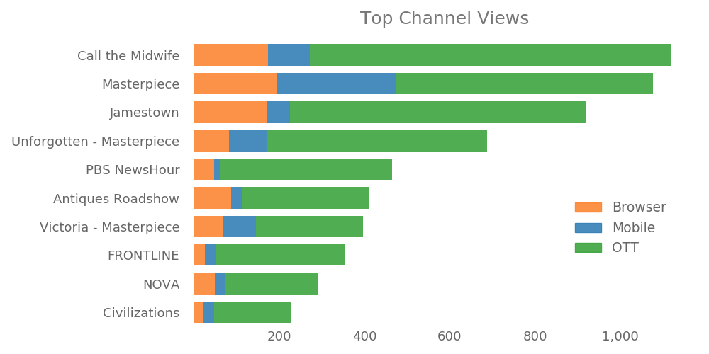

# KLRN Passport Analytics Database

This application cleans and parses PBS Passport viewing data, and stores results in a database.

This allows searches on what viewers watch, when they watch and how much they watch on web TV and in online apps. Data searches can also be cross-referenced with membership data. PBS provides the data monthly, in a Zip file.

### Getting started

This works with Python and the Python libraries NumPy and pandas. So make sure those are installed.

After cloning the application to your working environment, open the app folder and add the monthly Passport Zip files to the downloads folder.

Also in the app folder, open the **db_process.py** file. Under settings at the top, add all the Zip file names to the toParse list.

For example:

```python
#multiple files can be listed - which is important to seed start
toParse = [
    'KLRN_export_1_5_2017_all.zip',
    'KLRN_export_2_1_2017.zip',
    'KLRN_export_3_1_2017.zip',
    'KLRN_export_4_1_2017.zip',
    'KLRN_export_5_1_2017.zip',
    'KLRN_export_6_1_2017.zip',
    'KLRN_export_7_1_2017.zip'
]
```

Save the changes to **db_process.py**, and run the file to create the database.

This will also add a processing folder to handle Excel files pulled from the Zip files, and a committed folder to store those them as csv files for reference.

### Searching the database

Upload the database into a SQLite-compatible editor or viewer. A nice, free option is [DB Browser](https://sqlitebrowser.org/) for SQLite.

With DB Browser open, click the Open Database button at the top. In the file navigator that opens, go to app/database in the application and load **db.sqlite**.

Click the Browse Data tab to view, sort and filter the data tables.

Click the Execute SQL tab to open an interface to run SQL queries. In the app folder, the files ref_queries.txt and ref_queries_members.txt provide some basic queries.

<br>


### Visualizing data

To run visualizations, the Python library Matplotlib must be installed.

In the app folder, the files **queries_views_channels_bar.py** and **queries_views_channels_pie.py** will search top content shows by dates. Set the search dates under settings at the top of the files.

Running a visualization file will create an output_tables folder with a csv file of the results, and an output_graphics folder with a chart of the top shows.

<br>



### Cross-referencing membership data

Files starting with **queries_members\_** are customized to interact with Excel downloads resulting from specific queries made to an Allegiance database (KLRN's membership RMS).

In the app folder, **queries_members_personalized.py** gets top shows watched for each KLRN member listed in a spreadsheet, **queries_members_renewals.py** aggregates top shows for a list of members, and **queries_members_segments.py** gets top shows by first-time donors, major donors and sustainers.

### Other files

These files store background functions:

- **db_backup.py**
- **graphs.py**
- **helpers_process.py**
- **helpers_queries.py**
- **queries.py**

### References

- https://www.python.org/
- http://www.numpy.org/
- http://pandas.pydata.org/
- http://sqlitebrowser.org/
- http://matplotlib.org/
